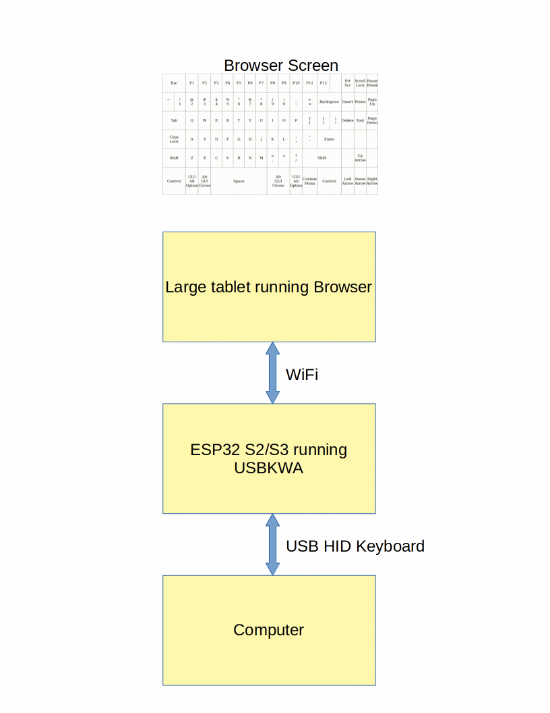

# USBKWA -- USB Keyboard Web App

USBKWA (USB Keyboard Web App) turns a large tablet or any device with a Web
browser into a USB keyboard. Anyone having difficulties using a regular
keyboard may find a touch keyboard easier to use.



[Screen capture of keyboard in browser window](./images/Screen_Keyboard.gif)

The keyboard web app displays a 17x6 grid in the browser window. The locations
of touch or mouse events are sent via a web socket back to the ESP32 web
server. The server translates locations to USB HID keycodes and sends them out
the USB HID keyboard interface.

The ESP32 S2 Saola board is programmed using the Arduino IDE. No soldering is
required. The browser communicates to the ESP32 using WiFi. The ESP32
communicates with the other computer using USB HID.

## Hardware

This should work on any ESP32 S2 board but has only been tested on the
Espressif Saola board. Regular ESP32 boards do not have native USB hardware so
will not work. The not yet released ESP32 S3 should also work.

* [ESP32-S2-Saola-1](https://docs.espressif.com/projects/esp-idf/en/latest/esp32s2/hw-reference/esp32s2/user-guide-saola-1-v1.2.html)
* [USB Device Driver](https://docs.espressif.com/projects/esp-idf/en/latest/esp32s2/api-reference/peripherals/usb_device.html)

## Software

* [Arduino IDE 1.8.16](https://www.arduino.cc/en/software)
* [Arduino ESP32 2.0.0](https://github.com/espressif/arduino-esp32#esp32-s2-and-esp32-c3-support)

The following libraries can be installed using the IDE Library Manager.

* [WebSockets by Markus Sattler](https://github.com/Links2004/arduinoWebSockets)
* [ArduinoJson by Benoit Blanchon](https://arduinojson.org/)

The following library is installed from github.com and patched for Arduino ESP32
2.0.0.

* [WiFiManager by tzapu/tablatronix](https://github.com/tzapu/WiFiManager)

```
cd <IDE library directory>
git clone https://github.com/tzapu/WiFiManager
cd WiFiManager
git cherry-pick a9507c9
git apply - <<EOF
diff --git a/WiFiManager.cpp b/WiFiManager.cpp
index 1dd199e..305ed11 100644
--- a/WiFiManager.cpp
+++ b/WiFiManager.cpp
@@ -3529,7 +3529,7 @@ void WiFiManager::WiFiEvent(WiFiEvent_t event,arduino_event_info_t info){
         WiFi.reconnect();
       #endif
   }
-  else if(event == SYSTEM_EVENT_SCAN_DONE){
+  else if(event == ARDUINO_EVENT_SC_SCAN_DONE){
     uint16_t scans = WiFi.scanComplete();
     WiFi_scanComplete(scans);
   }
EOF
```
